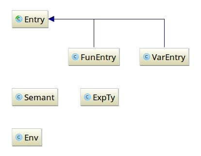
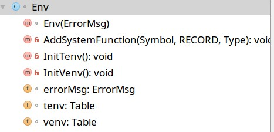
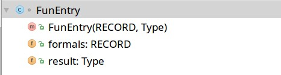
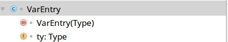

# 语义分析(chapter 5)

## 实验目的

通过符号表的构建,对`Parsing` 输出的抽象语法树进行类型检查.

本实验虎书并未提供现成框架,整个`Semant` package需要自己建立,当然虎书在pdf中已经提供了大部分的思路和实例代码了.主要工作便是将示例代码推广以及解决其中遇见的各种特殊情况.相比与词法分析与语法分析需要对课本有更深刻的掌握.

## 实验说明

### 实现说明

整体思路:

将语法分析输出的抽象语法输入至语义分析,在语义分析的过程中,构建符号表,一边进行符号表的增添,一边进行类型检查,当发现类型不匹配,便输出错误.

1. 符号表采用`Imperative Symbol Table` ,通过建立一个`undo`栈实现不同**环境**的保存.
2. 整个分析过程有两个**环境**(符号表实例),分别是`Tenv`和`Venv`. 

   - `Tenv`: Type Environment, 用于记录Type项的相关信息
   - `Venv`:Value Environment, 用于记录Function以及Variables
3. 类型检查有三个部分,分别为:

   - Type-check expression
   - Type-check variable subscript, and fields
   - Type-check Declaration 
4. 修改`Main.java`进行语义分析


### 类功能说明

| 类名       | 作用                                     |
| -------- | -------------------------------------- |
| Env      | 打印错误,初始化Tenv和Venv                      |
| Tenv     | Type Environment记录type                 |
| Venv     | Value Environment记录Function以及Variables |
| FunEntry | Function的信息类                           |
| VarEntry | Var的信息类                                |
| Semant   | 唯一可以被调用的公共类,用于语义分析,包括类型检查和填充符号表        |


## 实验步骤

1. 新建`Intellij IDEA` 工程文件,按照下列文件结构整合虎书框架`chap5`以及`Parsing`项目的文件.


   ```
.
├── Absyn [34 entries exceeds filelimit, not opening dir]
├── ErrorMsg
│   └── ErrorMsg.java
├── java_cup [66 entries exceeds filelimit, not opening dir]
├── Parse
│   ├── Grm.java
│   ├── Lexer.java
│   ├── Main.java
│   ├── Parse.java
│   ├── sym.java
│   └── Yylex.java
├── Symbol
│   ├── Symbol.java
│   └── Table.java
└── Types
    ├── ARRAY.java
    ├── INT.java
    ├── NAME.java
    ├── NIL.java
    ├── RECORD.java
    ├── STRING.java
    ├── Type.java
    └── VOID.java
   ```

2. 按照虎书`mcij_chapt05c.pdf`要求, 创建`Semant Package` ,并实现如下的目录结构:

   ```
   Semant
   ├── Entry.java
   ├── Env.java
   ├── ExpTy.java
   ├── FunEntry.java
   ├── Semant.java
   └── VarEntry.java
   ```

   类依赖图:

   

   在实现的过程中需要创建`Translate Package`新增`Exp.java`类,但是由于目前阶段不要求进行中间代码翻译,所以只需要提供一个空类即可,在`Semant.java`中采用null代替所有`Exp.java`类实例.

   ```java
   //Exp.java实现
   package Translate;
   public class Exp { }
   ```

3. 适当更改`Parse/Main` ,将抽象语法输入至语义分析中.


##  实验细节

### Env.java

类结构

 

Env 内部:

| 属性                | 作用                 |
| ----------------- | ------------------ |
| Table tenv        | 记录分析过程中的Type声明     |
| Table venv        | 记录分析过程中的变量声明以及函数申明 |
| ErrorMsg errorMsg | 记录分析过程中的发现的错误      |

| 函数                       | 作用                                       |
| ------------------------ | ---------------------------------------- |
| Env(ErrorMsg)            | 类的构造函数. `ErrorMsg`用于分析语义分析过程中的报错.        |
| InitTenv()               | 初始化Tenv, 主要需要添加预置的`int`和`sting` 两个type   |
| InitVenv()               | 初始化Venv,主要需要添加预置的函数,如`print()`,`flush()` 等 |
| AddSystemFunction (args) | 工具函数,添加函数至`Venv`                         |

### FunEntry.java VarEntry.java 

类结构

 

 

`FunEntry` 内部:

| 属性             | 作用     |
| -------------- | ------ |
| RECORD formals | 函数的参数  |
| Type result    | 函数的返回值 |

| 函数                    | 作用   |
| --------------------- | ---- |
| FunEntry(RECORD,Type) | 构造函数 |

`VarEntry`内部:

| 属性   | 作用   |
| ---- | ---- |
| type | 变量类型 |

| 函数             | 作用   |
| -------------- | ---- |
| VarEntry(Type) | 构造函数 |

### Semant.java

`Semant.java`是整个语义分析的核心部分,通过将语法分析结果输入进这个类,进而进行语义分析.由于`Semant`类内部函数过多,所以仅进行抽象分类.

| 函数                 | 作用                             |
| ------------------ | ------------------------------ |
| Semant(ErrorMsg)   | 类构造函数                          |
| error(int, String) | 报错函数                           |
| transProg(Exp)     | 被外界调用,用于分析抽象语法                 |
| transExp(args)     | 对表达式进行分析                       |
| transVar(args)     | 对变量进行分析                        |
| transDec(args)     | 对声明进行分析                        |
| transTy(Absyn.ty)  | 工具函数,用于将`Absyn`的类转化为相应的`Type`类 |

| 变量                          | 作用                    |
| --------------------------- | --------------------- |
| Env env                     | 符号表,其中包括`Venv`和`Tenv` |
| int loopCount               | 用于判断`Break `语句是否合法    |
| Type INT, STRING, NIL, VOID | 内置类型                  |

## 实验结果

### 正确输入:

对所有`More/Good`以及`Official/Good`下所有文件测试通过.

### 错误输入:

范例:

输入:`/home/emile/Documents/Github/TigerCompiler/TestCase/More/Bad/1.tig`

```
/* Type mismatch */
if true then 5 else "hello"
```

输出:

```
/home/emile/Documents/Github/TigerCompiler/TestCase/More/Bad/1.tig::2.3: Undeclared Variable : true
/home/emile/Documents/Github/TigerCompiler/TestCase/More/Bad/1.tig::1.21: Same Return Type Required!
```

这里提供了两个错误:

1. 提示`true`为未声明的变量,因为在虎书语言中并未将`true`和`false`列为关键字,所以会提示变量未声明.
2. 其次就是返回类型分别为`int`和`String`, 所以报错.

### 递归声明的检测

根据虎书的要求, `Semant.java`应当有能力检测出连续声明中存在的递归调用问题,比如下列输入:

输入: 

```
/* error: definition of recursive types is interrupted */
let
	type tree =treelist
	type treelist = tree
	var d:int :=0

in
	d
end
```

输出:

`/home/emile/Documents/Github/TigerCompiler/TestCase/More/Bad/15.tig::3.11: Loop Type Definition!`

## 实验总结

通过整个实验,对于编译器的类型检查过程有了更深的理解,也了解到编译器编写的复杂,特别是在没有框架,基本上整个语义分析模块都的自己编写的情况.

这里说几点不足之处:

1. 根据虎书`chapter 5` 中的想法, `Function`和`Variable` 的声明是同时使用`Venv` 的,但是这样会带来一个Bug,就是当声明的函数和变量同名时,先声明的会被后声明的覆盖.比如下面这个例子:

   ```
   /* bug: var a may covered by function a*/
   let type a = {a : int}
       var  a := 0
       function a (a : a) : a = a{a = a.a}
   in
       a (a{a = a})
   end
   ```

   类型检查后会提示说` a (a{a = a})` 中`a=a`的右值未声明,原因是在将`function a`添加进`Venv`后,会覆盖之前添加的`var a`. 

2. 递归声明的检测的情形其实很有限,仅限于类似虎书中提到的

   ```
   Type a=b
   Type b=c 
   Type c=a
   ```

   或者是

   ```
   function a()= b()
   functino b()= a()
   ```

   这几种类型.

   对于类似不那么明显的递归调用还是缺乏相关的实现,比如:

   ```
   let
   	type tree ={key: int, children: treelist}
   	type treelist = {hd: tree, tl: treelist}
   	var d:int :=0
   in
   	d
   end
   ```

   其中,`tree`和/* error: definition of recursive types is interrupted */`treelist`之间是存在递归调用的,但是却检测不出来. 因为虎书提供的`NAME.java`类中的`isLoop()`函数智慧检测最外层的属性,也就是说,会认为`tree.java`的属性是`Record`,而不会检测其内部是否存在递归的可能性.

